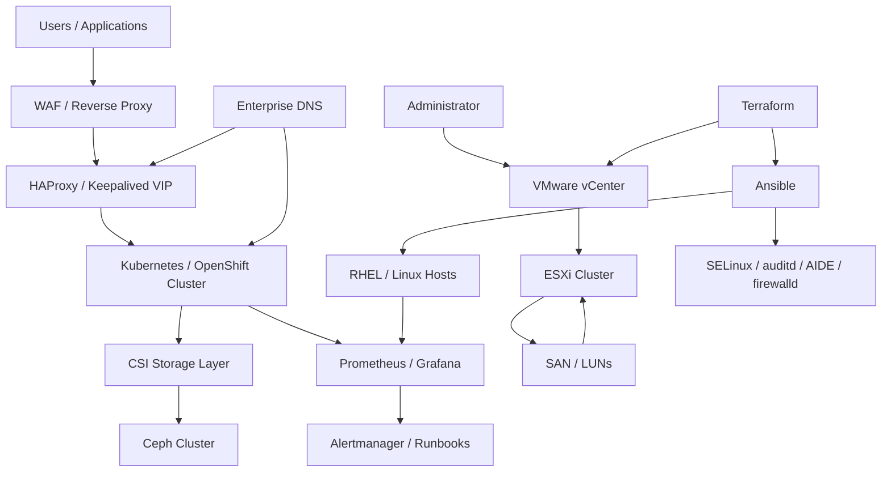

# Enterprise Infrastructure Architecture

This reference architecture shows how the portfolio domains fit together in a realistic enterprise environment.

## Engineering concerns demonstrated

- Separation of compute, network, storage and observability concerns.
- VMware provides the virtualization foundation for Linux and container platforms.
- HAProxy/Keepalived provides a stable API/application entry point.
- Ceph provides distributed storage consumed through CSI.
- Terraform handles repeatable infrastructure provisioning while Ansible handles host configuration.
- SELinux, auditd, AIDE and firewalld form the host-security layer.
- Prometheus/Grafana closes the operational loop with metrics, alerting and runbooks.

> Portfolio material is a public reference architecture. It intentionally contains no employer topology, credentials, customer information or proprietary configuration.
