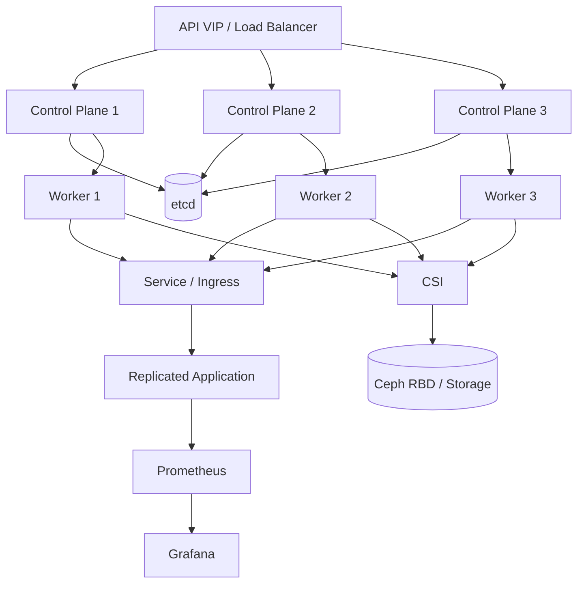

# Kubernetes HA Platform — Architecture & Evidence

## Architecture



## What this demonstrates

- HA control-plane design with a stable API endpoint.
- etcd quorum awareness and control-plane dependency analysis.
- Replicated workloads with readiness/liveness probes.
- Resource requests and limits to improve scheduling predictability.
- Service-based workload exposure.
- CSI-backed persistent storage.
- Monitoring and operational troubleshooting.

## Troubleshooting scenarios

### API server unreachable

1. Validate DNS and the API VIP.
2. Test TCP connectivity to the API port.
3. Check load-balancer health and backend state.
4. Inspect control-plane kubelet and API-server logs.
5. Validate certificates and SANs.
6. Confirm etcd health and quorum.

### Pod stuck in Pending

```bash
kubectl describe pod <pod> -n <namespace>
kubectl get events -n <namespace> --sort-by=.lastTimestamp
kubectl get nodes --show-labels
kubectl get pvc -n <namespace>
```

Focus on scheduler events, resource pressure, node selectors/taints and PVC binding rather than restarting components blindly.

### Application is Running but not Ready

```bash
kubectl describe pod <pod> -n <namespace>
kubectl logs <pod> -n <namespace>
kubectl get endpoints <service> -n <namespace>
```

Validate the probe path, application listener, service selector and endpoint population.

## Evidence policy

Examples are lab/reference material. No production screenshots, credentials, client identifiers or fabricated incident metrics are included.
