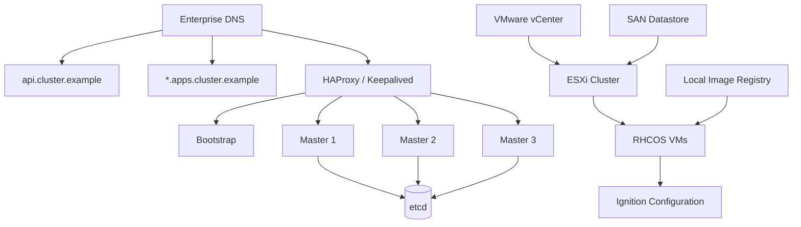

# OpenShift UPI on VMware — Architecture & Troubleshooting

## Reference architecture



## Deployment flow

1. Prepare DNS and API/application records.
2. Prepare HAProxy/Keepalived VIPs and backend health checks.
3. Prepare RHCOS VM templates on VMware.
4. Generate and distribute Ignition configuration.
5. Mirror required OpenShift release content to an accessible registry when disconnected or restricted environments require it.
6. Provision bootstrap and control-plane VMs.
7. Validate certificate SANs, DNS resolution and API reachability.
8. Complete bootstrap and add worker capacity.
9. Validate cluster operators and application ingress.

## High-value troubleshooting scenarios

### Ignition fetch hangs

Check:

```bash
curl -vk https://<ignition-endpoint>/bootstrap.ign
resolvectl status
journalctl -b -u ignition-firstboot-complete.service
journalctl -b | grep -i ignition
```

Common causes include DNS failure, unreachable endpoints, incorrect certificates, proxy restrictions and incorrect Ignition URLs.

### API certificate/SAN mismatch

Validate the hostname used by clients and inspect the certificate:

```bash
openssl s_client -connect api.cluster.example:6443 -servername api.cluster.example </dev/null 2>/dev/null | openssl x509 -noout -subject -issuer -ext subjectAltName
```

The endpoint clients use must be represented in the certificate SANs.

### Bootstrap appears unreachable

Validate DNS, VIP routing, HAProxy backend health, firewall policy and VM network attachment before modifying cluster configuration.

> This is a public reference architecture based on lab/engineering patterns. It does not expose employer topology, credentials or proprietary deployment data.
