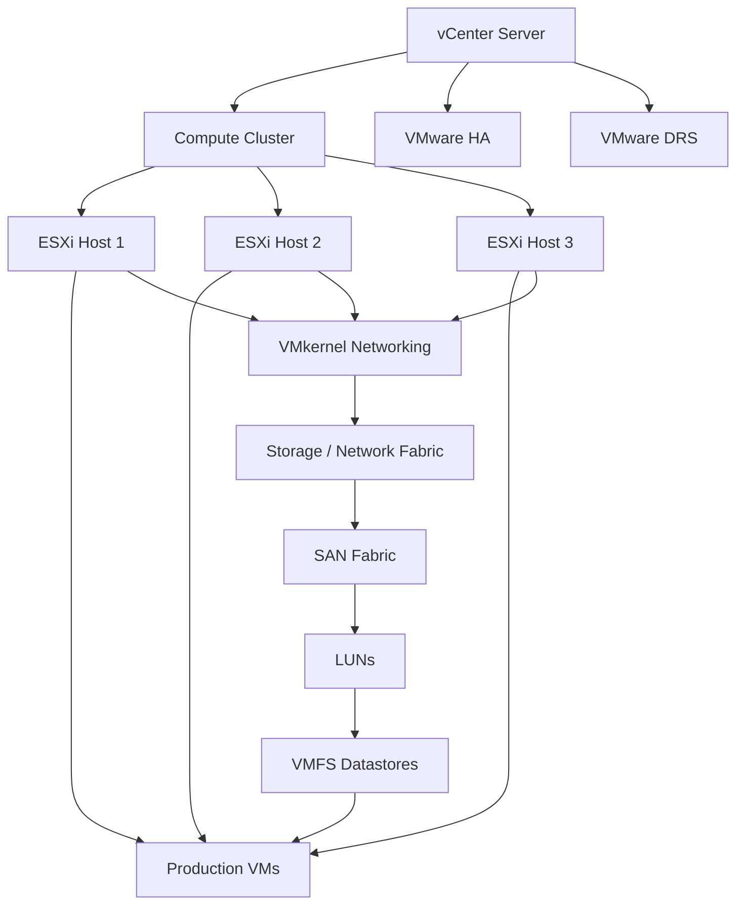

# VMware HA / DRS / SAN — Architecture & Operations

## Reference architecture



## HA vs DRS

| Capability | VMware HA | VMware DRS |
|---|---|---|
| Primary purpose | Recover VMs after host failure | Balance workload across hosts |
| Trigger | Host failure | Resource imbalance / policy |
| Main concern | Availability | Resource placement |
| Typical action | Restart VM on another host | Recommend or perform migration |

HA and DRS solve different operational problems and are commonly used together.

## SAN / multipathing validation

Typical validation areas:

```bash
esxcli storage core adapter list
esxcli storage core path list
esxcli storage filesystem list
```

Validate HBA visibility, paths, datastore presentation, path state and multipathing policy before treating storage latency as a guest-OS issue.

## Operational troubleshooting flow

1. Identify whether the symptom is compute, network or storage related.
2. Check vCenter alarms and host health.
3. Check VM CPU/memory contention and datastore latency.
4. Validate VMkernel paths and SAN path state.
5. Review HA/DRS events and recent host changes.
6. Correct the lowest layer that explains the symptom.
7. Validate application health after remediation.

> Reference architecture only. No production hostnames, SAN identifiers, credentials or proprietary diagrams are included.
